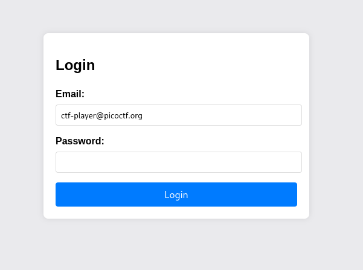
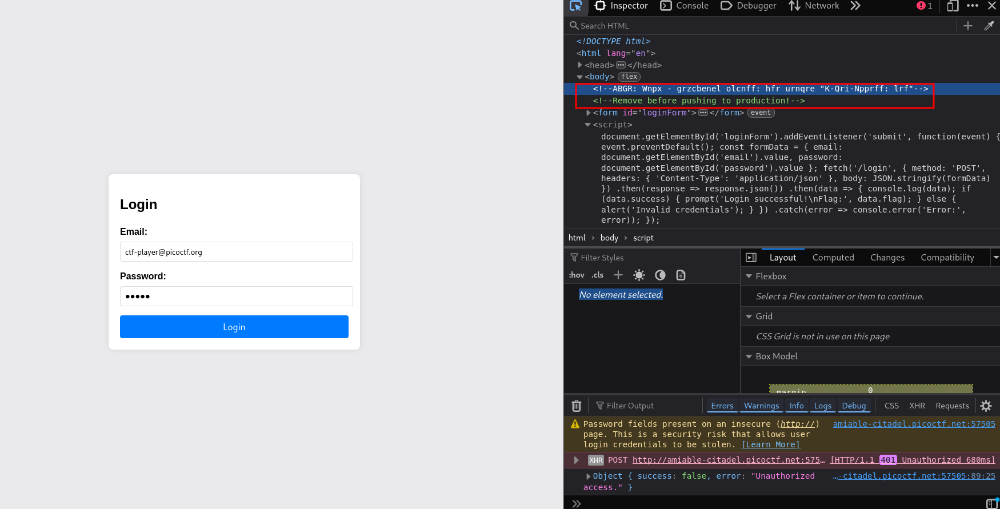
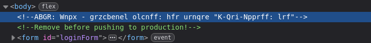
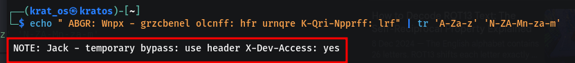
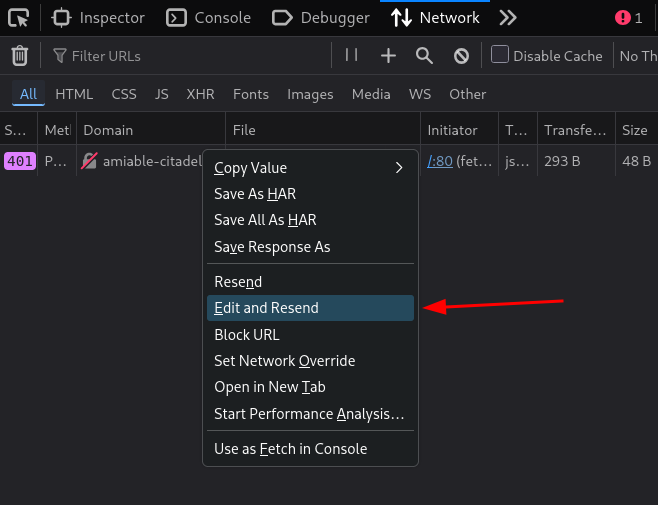
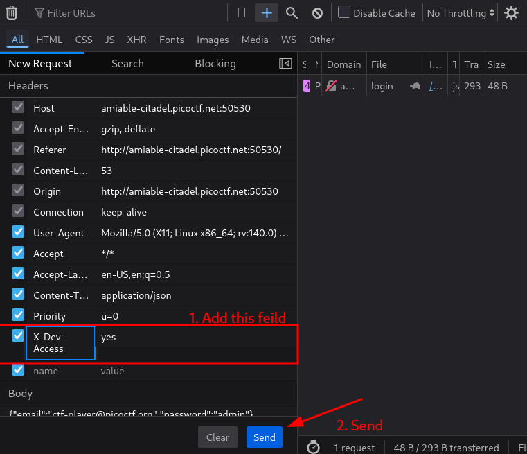
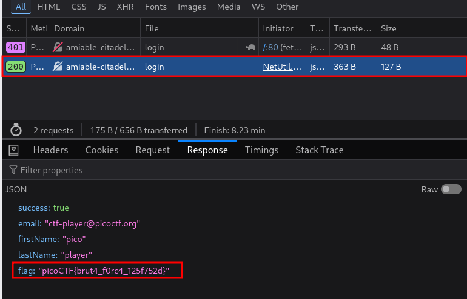

We’re in the middle of an investigation. One of our persons of interest, ctf player, is believed to be hiding sensitive data inside a restricted web portal. We’ve uncovered the email address he uses to log in: `ctf-player@picoctf.org`. Unfortunately, we don’t know the password, and the usual guessing techniques haven’t worked. But something feels off... it’s almost like the developer left a secret way in. Can you figure it out?



In the HTML for this site you can see some unusual text



This is kind of a Caesar cipher or ROT X 

```
 ABGR: Wnpx - grzcbenel olcnff: hfr urnqre "K-Qri-Npprff: lrf" 
```

This is a ROT 13 where `NOTE->ABGR ` so we can use 

```bash
echo "<Input>" | tr 'A-Za-z' 'N-ZA-Mn-za-m'
```



This X-Dev-Access is basically a header in the request that we send  (in the Post method )





These are custom end points made by the developer while the testing and development stages 




```
picoCTF{brut4_f0rc4_125f752d}
```

