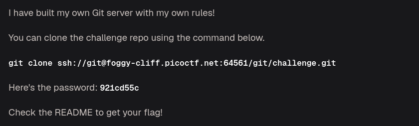
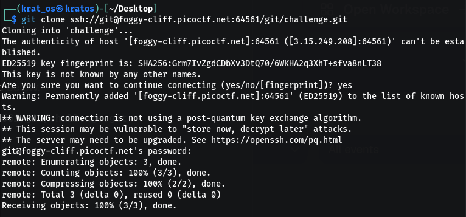
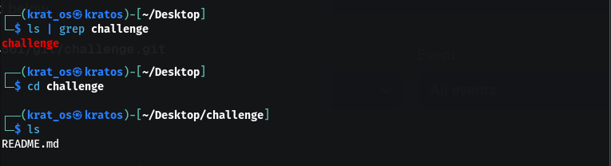
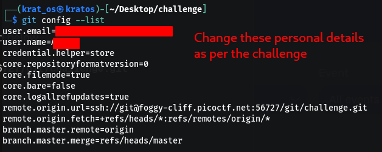
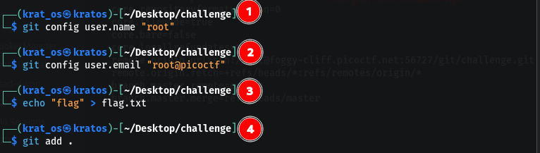
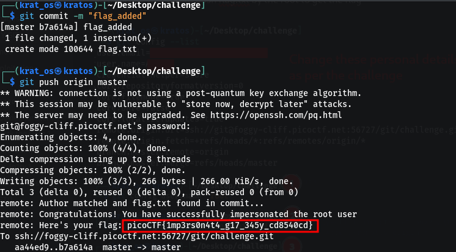

Contents of the README.md
```bash
┌──(krat_os㉿kratos)-[~/Desktop/challenge]
└─$ cat README.md   
# MyGit

### If you want the flag, make sure to push the flag!

Only flag.txt pushed by ```root:root@picoctf``` will be updated with the flag.

GOOD LUCK!
```

So basically we have to push flag.txt by the root to get the flag 






```
picoCTF{1mp3rs0n4t4_g17_345y_cd8540cd}
```

