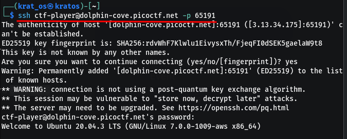
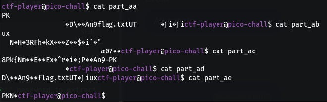
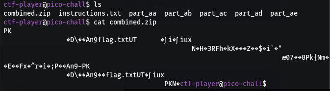
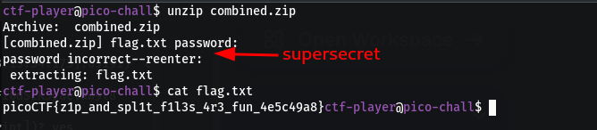

![[Pasted image 20260811212041.png|700]]

Use this command                                                                                                                                                      
```bash 
ssh ctf-player@dolphin-cove.picoctf.net -p 65191
```


![[Pasted image 20260811212317.png|700]]

```bash
ctf-player@pico-chall$ cat instructions.txt 
Hint:

- The flag is split into multiple parts as a zipped file.
- Use Linux commands to combine the parts into one file.
- The zip file is password protected. Use this "supersecret" password to extract the zip file.
- After unzipping, check the extracted text file for the flag.

```

we can see the non readable text in those files                                                                                                          


Only the first part is a zip / archive                                                                                     ![[Pasted image 20260811212749.png|700]]
The `unzip` command suggests that this is a multi part archive                                                                      
![[Pasted image 20260811213632.png|700]]

If we do the same to part ab, ac, ad the same message display but when done to part ae 
![[Pasted image 20260811213815.png|700]]

so we combine all the parts to a `combined.zip`

```bash
cat part* > combined.zip
```






The password was `supersecret` already mentioned in a `txt`file 
```
picoCTF{z1p_and_spl1t_f1l3s_4r3_fun_4e5c49a8}
```

