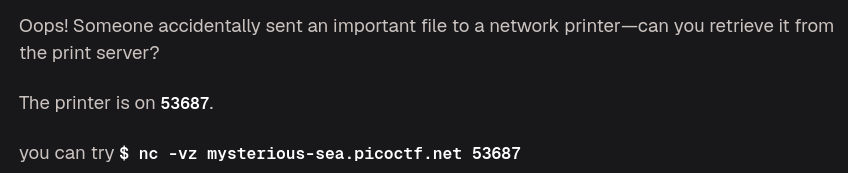
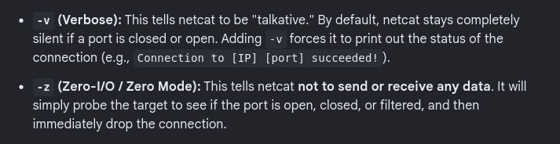
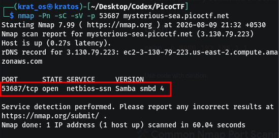
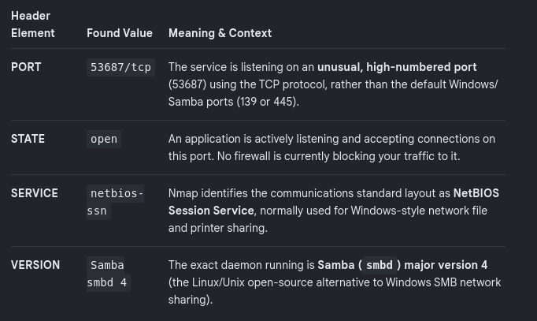
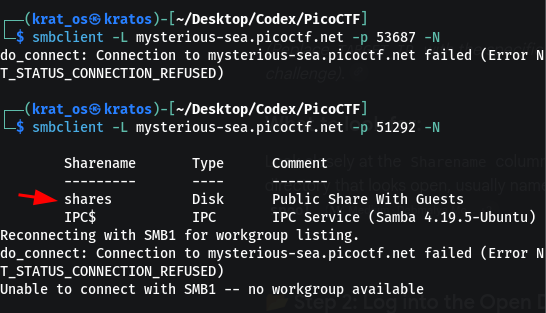
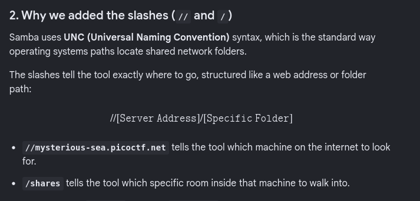
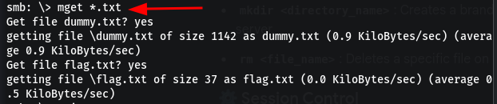
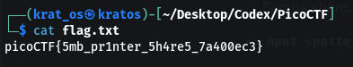

the V and Z in switches in the command are 


![[Pasted image 20260809212007.png|700]]


let's see what type of port is this                                                                                                             


more about what we got                                                                  


while normal samba ports are `139` and `445` here we are getting this `53687` , also its open so we can run smbclient 
```bash
smbclient -L mysterious-sea.picoctf.net -p 51292 -N
```



As its a smaba client we can use `smbclient` and `smbutil`
	Now we want to navigate into the `shares` so we can use this command 
	
```bash
smbclient //mysterious-sea.picoctf.net/shares -p 51292 -N
```



![[Pasted image 20260809215126.png|700]]

get the files using the `mget <pattern_or_*>`                                                                                            





```
picoCTF{5mb_pr1nter_5h4re5_7a400ec3}
```

