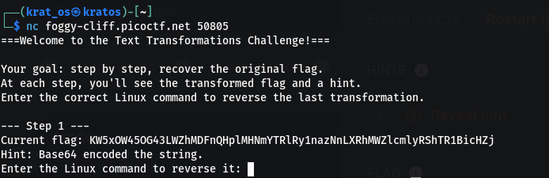
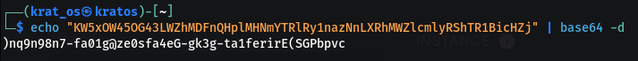
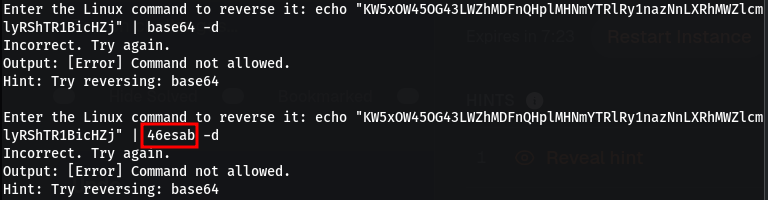
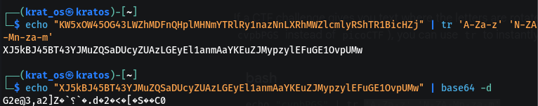
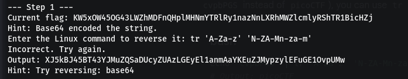
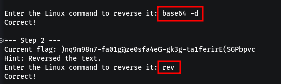
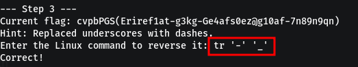
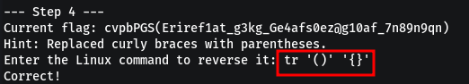
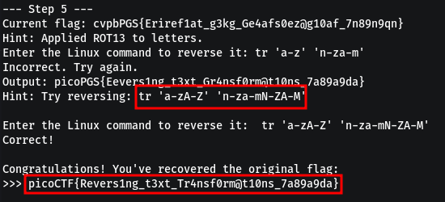

When we put this on the terminal 
.


1)  We are already provided with a scrambled/encoded flag 
2) the Hint suggests that its base64 encoded 

### Failed Attempts
we try to reverse the process 
.


so we need to put some command that can reverse it on the net cat terminal 
.
some failed attempts 


this is the site that was there in the hints 
https://man7.org/linux/man-pages/man1/tr.1.html

so i am guessing we have to reverse the whole encoded string using the tr command .

another failed attempt ( I was trying ROT13 )
.



This time we get something different in the nc terminal 
.



### Finally 
1) use  baes64 -d to decode the encoded string 
2) and then reverse the string 
.


4) 
5) 
6) 

so all the commands in line are 

```bash 
base64 -d
rev
tr '-' '_'
tr '()' '{}' 
tr 'a-zA-Z' 'n-za-mN-ZA-M'
```

```
picoCTF{Revers1ng_t3xt_Tr4nsf0rm@t10ns_7a89a9da}
```

