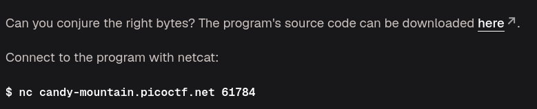
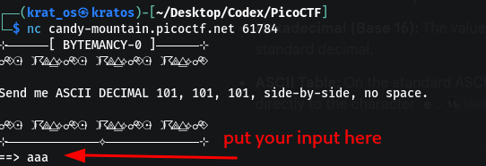
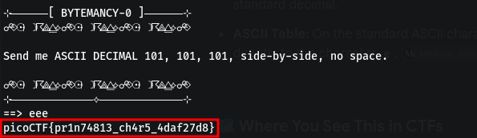

The file available for download is a python file `App.py` with this code 

```python
while(True):
  try:
    print('⊹──────[ BYTEMANCY-0 ]──────⊹')
    print("☍⟐☉⟊☽☈⟁⧋⟡☍⟐☉⟊☽☈⟁⧋⟡☍⟐☉⟊☽☈⟁⧋⟡☍⟐")
    print()
    print('Send me ASCII DECIMAL 101, 101, 101, side-by-side, no space.')
    print()
    print("☍⟐☉⟊☽☈⟁⧋⟡☍⟐☉⟊☽☈⟁⧋⟡☍⟐☉⟊☽☈⟁⧋⟡☍⟐")
    print('⊹─────────────⟡─────────────⊹')
    user_input = input('==> ')
    if user_input == "\x65\x65\x65":
      print(open("./flag.txt", "r").read())
      break
    else:
      print("That wasn't it. I got: " + str(user_input))
      print()
      print()
      print()
  except Exception as e:
    print(e)
    break
```

And when you nc onto the given web-server                                                                                                   



As you can see in the source code it checks if the input is `\x65` and in ASCII  `(65 -> e)`



```
picoCTF{pr1n74813_ch4r5_4daf27d8}
```

