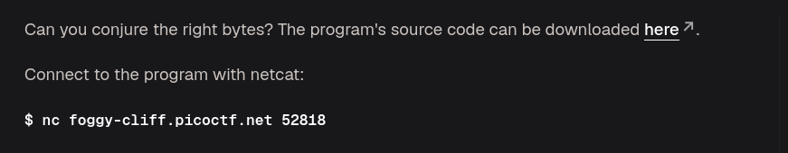
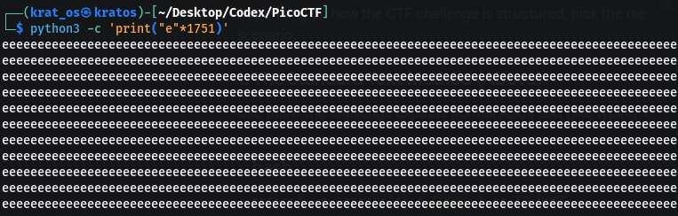
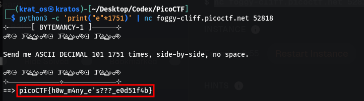

The file source code contains 
```python
while(True):
  try:
    print('⊹──────[ BYTEMANCY-1 ]──────⊹')
    print("☍⟐☉⟊☽☈⟁⧋⟡☍⟐☉⟊☽☈⟁⧋⟡☍⟐☉⟊☽☈⟁⧋⟡☍⟐")
    print()
    print('Send me ASCII DECIMAL 101 1751 times, side-by-side, no space.')
    print()
    print("☍⟐☉⟊☽☈⟁⧋⟡☍⟐☉⟊☽☈⟁⧋⟡☍⟐☉⟊☽☈⟁⧋⟡☍⟐")
    print('⊹─────────────⟡─────────────⊹')
    user_input = input('==> ')
    if user_input == "\x65"*1751:
      print(open("./flag.txt", "r").read())
      break
    else:
      print("That wasn't it. I got: " + str(user_input))
      print()
      print()
      print()
  except Exception as e:
    print(e)
    break

```

As you can see this time we have to put `eeee.....1751 times` for that we can use a python code with a pipe operation to the nc command 





```
picoCTF{h0w_m4ny_e's???_e0d51f4b}
```