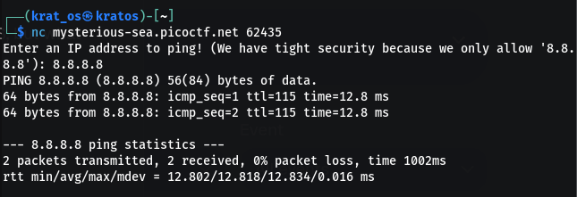
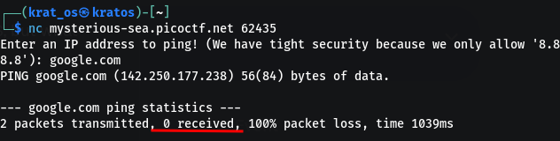

This is the output if we follow what pops up when we nc to this                                


but if we use any other ip or domain                                                                                         


So basically its running a terminal where you are putting a `<ip>`and for that the corresponding command would be like 

```bash
ping <ip> -c 2
```

you need to change this command a bit and think of #command_injection                               
![[Pasted image 20260811211656.png|700]]

Just simply adding `| ls` gave away the cover and now you can `cat` the file similarly 
![[Pasted image 20260811211815.png|700]]

```
picoCTF{p1nG_c0mm@nd_3xpL0it_su33essFuL_17ae04f2}  
```


This is the content of the `script.sh` 
```bash
#!/bin/bash
echo -n "Enter an IP address to ping! (We have tight security because we only allow '8.8.8.8'): "
read domain
bash -c "ping -c2 $domain"
```
