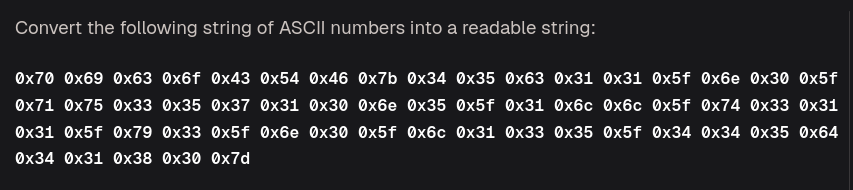

Very Simple just convert these Hex -> Decimal -> Ascii symbol or just Hex-> Ascii 

Using a very script generated through AI :) (just using int() and chr())
```python
def convert_hex_to_ascii():
    # Take raw input from the user
    user_input = input("Enter your hex values (e.g., 0x70 0x69): ")
    
    # Split the string by spaces to isolate each hex token
    hex_tokens = user_input.strip().split()
    
    full_string = ""
    
    for token in hex_tokens:
        try:
            # 1. Convert hex string to a decimal integer
            decimal_value = int(token, 16)
            
            # 2. Convert decimal integer to its ASCII character
            ascii_symbol = chr(decimal_value)
            
            # Accumulate the final decoded string
            full_string += ascii_symbol
            
        except ValueError:
            print(token,"[Invalid Hex Formatter]")
            
    print(f"Full Decoded String: {full_string}\n")

# Run the script
if __name__ == "__main__":
    convert_hex_to_ascii()
                         
```

get the flag 
```bash
Full Decoded String: picoCTF{45c11_n0_qu35710n5_1ll_t311_y3_n0_l135_445d4180}
```
