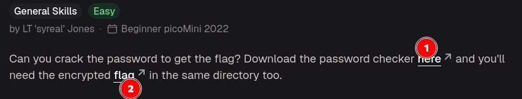
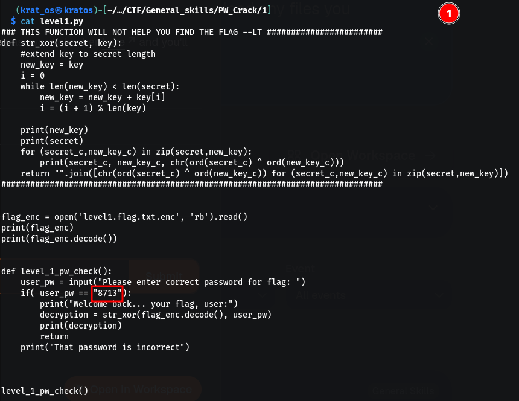
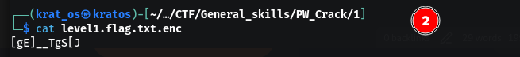
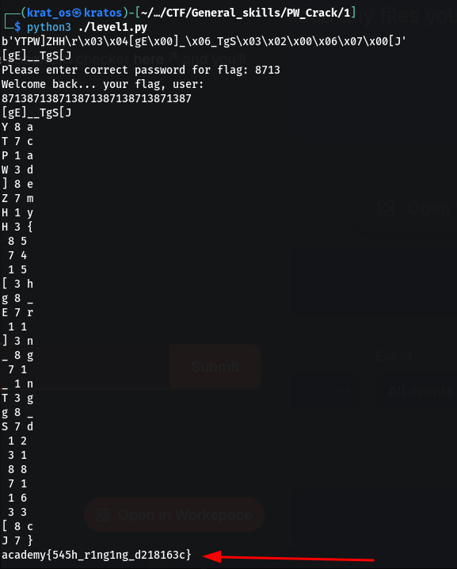
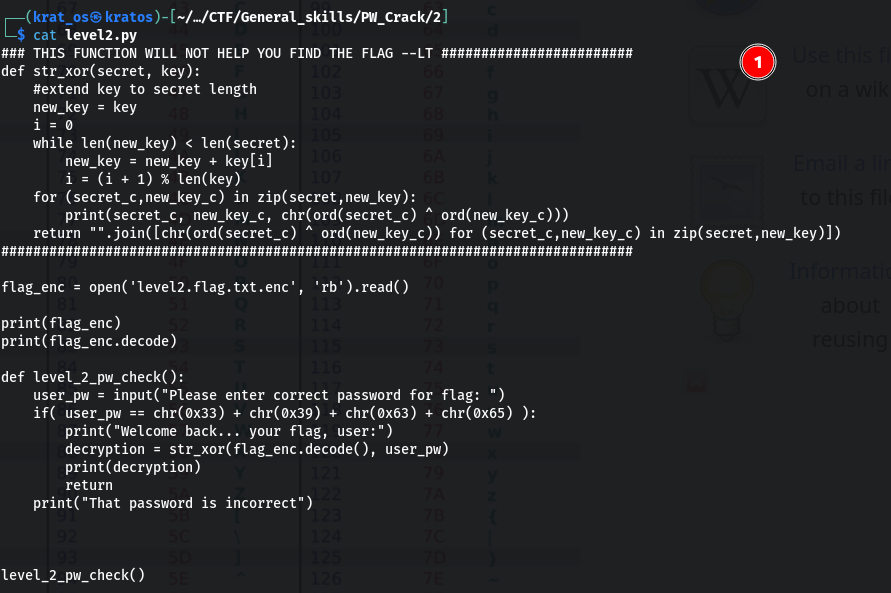
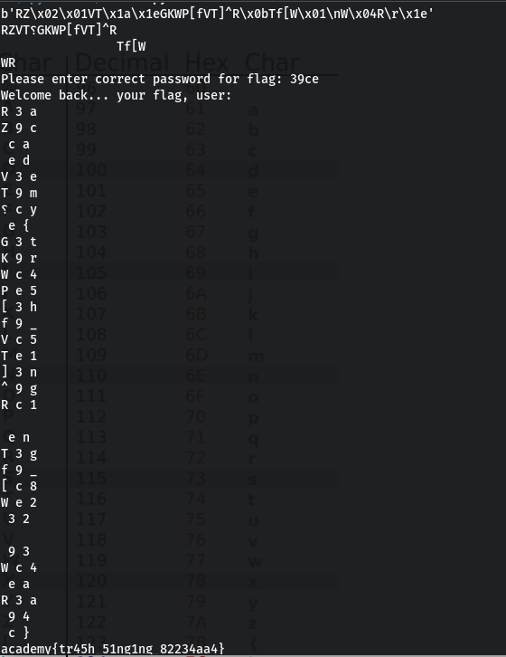
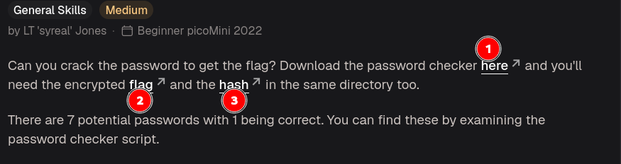
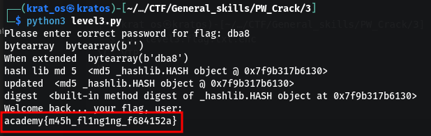
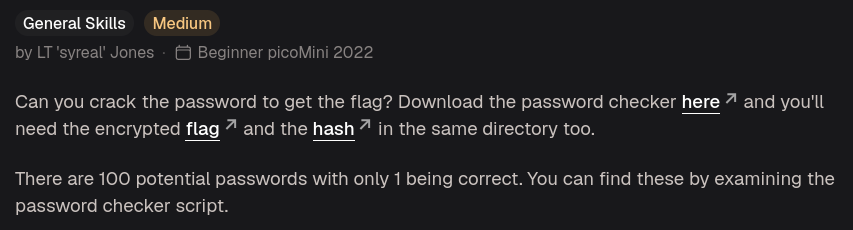
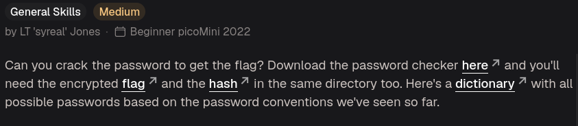

# PW Crack 1




I added some extra print statements to debug here its mainly doing is Xor (Ascii(87138......) ^ Ascii(secret))                                                                                                                                                             





# PW Crack 2


This is the code this time  ( put some print statements to see the values )                                              


Here the only diff is just that we have to find the value of user_pw                                             
```
Ascii -> Char
0x33 -> 3
0x39 -> 9
0x63 -> c
0x65 -> e
```

This will happen when you apply the password                                                                                          


# PW Crack 3


The code 
```python
import hashlib

### THIS FUNCTION WILL NOT HELP YOU FIND THE FLAG --LT ########################
def str_xor(secret, key):
    #extend key to secret length
    new_key = key
    i = 0
    while len(new_key) < len(secret):
        new_key = new_key + key[i]
        i = (i + 1) % len(key)        
    return "".join([chr(ord(secret_c) ^ ord(new_key_c)) for (secret_c,new_key_c) in zip(secret,new_key)])
###############################################################################

flag_enc = open('level3.flag.txt.enc', 'rb').read()
correct_pw_hash = open('level3.hash.bin', 'rb').read()


def hash_pw(pw_str):
    pw_bytes = bytearray()
    pw_bytes.extend(pw_str.encode())
    m = hashlib.md5()
    m.update(pw_bytes)
    return m.digest()


def level_3_pw_check():
    user_pw = input("Please enter correct password for flag: ")
    user_pw_hash = hash_pw(user_pw)
    
    if( user_pw_hash == correct_pw_hash ):
        print("Welcome back... your flag, user:")
        decryption = str_xor(flag_enc.decode(), user_pw)
        print(decryption)
        return
    print("That password is incorrect")


level_3_pw_check()


# The strings below are 7 possibilities for the correct password. 
#   (Only 1 is correct)
pos_pw_list = ["f09e", "4dcf", "87ab", "dba8", "752e", "3961", "f159"]

```

I have added a get pass to get the correct password
```python
# The strings below are 7 possibilities for the correct password. 
#   (Only 1 is correct)
pos_pw_list = ["f09e", "4dcf", "87ab", "dba8", "752e", "3961", "f159"]

def get_pass(pos_pw_list):
    for pos_pass in pos_pw_list:
        if(correct_pw_hash == hash_pw(pos_pass)):
            print("This is the correct pass ",pos_pass, " and " , hash(pos_pass))
        else:
            print("This is incorrect " ,pos_pass , " and ",  hash(pos_pass))    

get_pass(pos_pw_list)
```

```bash
┌──(krat_os㉿kratos)-[~/…/CTF/General_skills/PW_Crack/3]
└─$ python3 level3.py
This is incorrect  f09e  and  -6475361182860033725
This is incorrect  4dcf  and  7410208081525556687
This is incorrect  87ab  and  6162946889841533681
This is the correct pass  dba8  and  -2897810933060374929
This is incorrect  752e  and  -4033764569135552520
This is incorrect  3961  and  4318560624789222707
This is incorrect  f159  and  -3883127322515169213
```

This is the content of `2` and `3` from the image 
```bash
──(krat_os㉿kratos)-[~/…/CTF/General_skills/PW_Crack/3]
└─$ cat level3.hash.bin 
e�Ǝ�yi�␦������                                                                                                                  
┌──(krat_os㉿kratos)-[~/…/CTF/General_skills/PW_Crack/3]
└─$ cat level3.flag.txt.enc 
\C	VTP;
V                                                                                


```

and when we put the right pass                                                                                                                                      


this is what I  get to see when we is the `bvi` 
```bash
00000000  65 D9 C6 8E 03 80 79 69 85 1A 83 B2 8B BE BE D1                         e.....yi........
```


# PW Check 4


This is the source code 
```python
import hashlib

### THIS FUNCTION WILL NOT HELP YOU FIND THE FLAG --LT ########################
def str_xor(secret, key):
    #extend key to secret length
    new_key = key
    i = 0
    while len(new_key) < len(secret):
        new_key = new_key + key[i]
        i = (i + 1) % len(key)        
    return "".join([chr(ord(secret_c) ^ ord(new_key_c)) for (secret_c,new_key_c) in zip(secret,new_key)])
###############################################################################

flag_enc = open('level4.flag.txt.enc', 'rb').read()
correct_pw_hash = open('level4.hash.bin', 'rb').read()


def hash_pw(pw_str):
    pw_bytes = bytearray()
    pw_bytes.extend(pw_str.encode())
    m = hashlib.md5()
    m.update(pw_bytes)
    return m.digest()


def level_4_pw_check():
    user_pw = input("Please enter correct password for flag: ")
    user_pw_hash = hash_pw(user_pw)
    
    if( user_pw_hash == correct_pw_hash ):
        print("Welcome back... your flag, user:")
        decryption = str_xor(flag_enc.decode(), user_pw)
        print(decryption)
        return
    print("That password is incorrect")


level_4_pw_check()


# The strings below are 100 possibilities for the correct password. 
#   (Only 1 is correct)
pos_pw_list = ["6288", "6152", "4c7a", "b722", "9a6e", "6717", "4389", "1a28", "37ac", "de4f", "eb28", "351b", "3d58", "948b", "231b", "973a", "a087", "384a", "6d3c", "9065", "725c", "fd60", "4d4f", "6a60", "7213", "93e6", "8c54", "537d", "a1da", "c718", "9de8", "ebe3", "f1c5", "a0bf", "ccab", "4938", "8f97", "3327", "8029", "41f2", "a04f", "c7f9", "b453", "90a5", "25dc", "26b0", "cb42", "de89", "2451", "1dd3", "7f2c", "8919", "f3a9", "b88f", "eaa8", "776a", "6236", "98f5", "492b", "507d", "18e8", "cfb5", "76fd", "6017", "30de", "bbae", "354e", "4013", "3153", "e9cc", "cba9", "25ea", "c06c", "a166", "faf1", "2264", "2179", "cf30", "4b47", "3446", "b213", "88a3", "6253", "db88", "c38c", "a48c", "3e4f", "7208", "9dcb", "fc77", "e2cf", "8552", "f6f8", "7079", "42ef", "391e", "8a6d", "2154", "d964", "49ec"]

```

This is what i get when I do `bvi `
```bash
00000000  96 CD 09 16 6E 99 0A 24 05 2D 67 4A 53 64 3D 2F                         ....n..$.-gJSd=/
```

We can just use the same script to get the password 
```python
# The strings below are 100 possibilities for the correct password. 
#   (Only 1 is correct)
pos_pw_list = ["6288", "6152", "4c7a", "b722", "9a6e", "6717", "4389", "1a28", "37ac", "de4f", "eb28", "351b", "3d58", "948b", "231b", "973a", "a087", "384a", "6d3c", "9065", "725c", "fd60", "4d4f", "6a60", "7213", "93e6", "8c54", "537d", "a1da", "c718", "9de8", "ebe3", "f1c5", "a0bf", "ccab", "4938", "8f97", "3327", "8029", "41f2", "a04f", "c7f9", "b453", "90a5", "25dc", "26b0", "cb42", "de89", "2451", "1dd3", "7f2c", "8919", "f3a9", "b88f", "eaa8", "776a", "6236", "98f5", "492b", "507d", "18e8", "cfb5", "76fd", "6017", "30de", "bbae", "354e", "4013", "3153", "e9cc", "cba9", "25ea", "c06c", "a166", "faf1", "2264", "2179", "cf30", "4b47", "3446", "b213", "88a3", "6253", "db88", "c38c", "a48c", "3e4f", "7208", "9dcb", "fc77", "e2cf", "8552", "f6f8", "7079", "42ef", "391e", "8a6d", "2154", "d964", "49ec"]

def get_pass(pos_pw_list):
    for pos_pass in pos_pw_list:
        if(correct_pw_hash == hash_pw(pos_pass)):
            print("This is the correct pass ",pos_pass, " and " , hash(pos_pass))
        else:
            print("This is incorrect " ,pos_pass , " and ",  hash(pos_pass))    

get_pass(pos_pw_list)

```

```python
This is incorrect  b88f  and  4252389539250768979
This is incorrect  eaa8  and  -1854332703221537423
This is incorrect  776a  and  -3762803067347224635
This is incorrect  6236  and  5753797264898616762
This is incorrect  98f5  and  7200653363577843372
This is incorrect  492b  and  3075666588249021949
This is the correct pass  507d  and  8436133238294930582
This is incorrect  18e8  and  3413406082708345703
This is incorrect  cfb5  and  4537251266645488690
This is incorrect  76fd  and  2572404244475994923
This is incorrect  6017  and  -580844612823862287
```

And this is the pass
```bash
Please enter correct password for flag: 507d
Welcome back... your flag, user:
academy{fl45h_5pr1ng1ng_f8cf5d9c}
```

# PW Crack 5



The dictionary contains all numbers form `0000` to `ffff`

This is the contents of the flag.txt
```bash
┌──(krat_os㉿kratos)-[~/…/CTF/General_skills/PW_Crack/5]
└─$ cat level5.flag.txt.enc 
YfFTWRAJ_^j]T
E    
```

This is the contents of hash.bin
```bash
00000000  12 36 50 DD 05 60 58 79 18 B3 D7 71 CF 0C 01 71                         .6P..`Xy...q...q

```

So basically we have to use the dictionary to get the password so we can add code to do that in this level5.py file 

```python
import hashlib

### THIS FUNCTION WILL NOT HELP YOU FIND THE FLAG --LT ########################
def str_xor(secret, key):
    #extend key to secret length
    new_key = key
    i = 0
    while len(new_key) < len(secret):
        new_key = new_key + key[i]
        i = (i + 1) % len(key)        
    return "".join([chr(ord(secret_c) ^ ord(new_key_c)) for (secret_c,new_key_c) in zip(secret,new_key)])
###############################################################################

flag_enc = open('level5.flag.txt.enc', 'rb').read()
correct_pw_hash = open('level5.hash.bin', 'rb').read()


def hash_pw(pw_str):
    pw_bytes = bytearray()
    pw_bytes.extend(pw_str.encode())
    m = hashlib.md5()
    m.update(pw_bytes)
    return m.digest()


def level_5_pw_check():
    user_pw = input("Please enter correct password for flag: ")
    user_pw_hash = hash_pw(user_pw)
    
    if( user_pw_hash == correct_pw_hash ):
        print("Welcome back... your flag, user:")
        decryption = str_xor(flag_enc.decode(), user_pw)
        print(decryption)
        return
    print("That password is incorrect")


level_5_pw_check()
```

This is the change i did in the code 
```python
def level_5_pw_check():
    nums = []
    with open('dictionary.txt', 'r') as file:
        for line in file:
            number = line.strip()
            nums.append(number)
    #user_pw = input("Please enter correct password for flag: ")
    #user_pw_hash = hash_pw(user_pw)
    for num in nums:
        user_pw_hash = hash_pw(num)
        if( user_pw_hash == correct_pw_hash ):
            print("Welcome back... your flag, user:")
            decryption = str_xor(flag_enc.decode(), num)
            print(decryption)
            return
        print("That password is incorrect")


level_5_pw_check()
```

```python
That password is incorrect
That password is incorrect
That password is incorrect
That password is incorrect
That password is incorrect
That password is incorrect
That password is incorrect
That password is incorrect
That password is incorrect
Welcome back... your flag, user:
academy{h45h_sl1ng1ng_75da2576}
```

