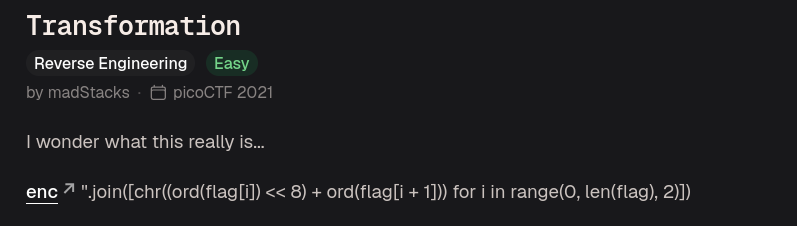
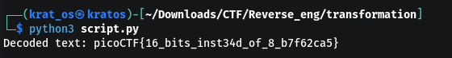

what does enc contain 
```bash
灩捯䍔䙻ㄶ形楴獟楮獴㌴摟潦弸形㝦㘲捡㕽
```

explanation for the operations done 


so we can reverse this by this python code 
```python
# Open and read the encoded file from the same directory
with open("enc", "r", encoding="utf-8") as file:
    encoded_flag = file.read().strip()

original_flag = ""
for char in encoded_flag:
    val = ord(char)
    
    char1 = chr(val >> 8)

    char2 = chr(val & 0xFF)
    original_flag += char1 + char2

print("Decoded text:", original_flag)
```

then you can get the flag 
