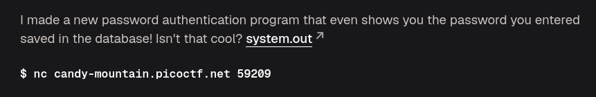
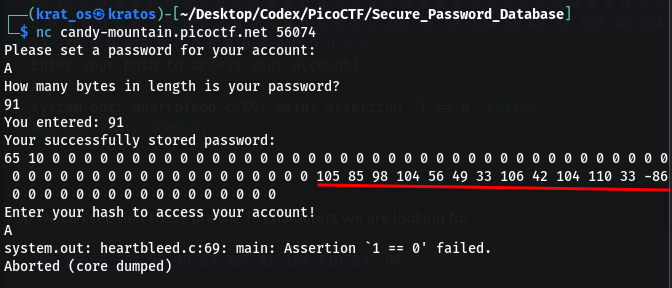
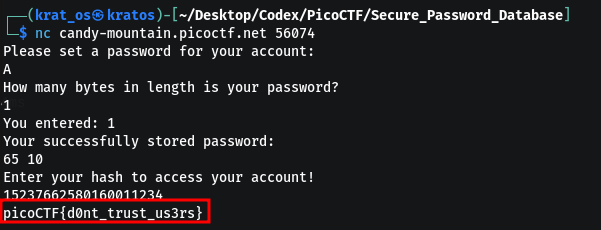

`system.out` is a binary file use a bin->code converter [[https://dogbolt.org|Decompiler]]

This is the de-compiled code 
```c
#include "out.h"

// these are the headers 
undefined main;
undefined1 completed.0;
pointer __dso_handle;
undefined1[13] obf_bytes;    //<---- this is used to obfuscated
undefined8 stdin;

```


There are 2 helper functions and a main 

This is used to make the secret 
```c
void make_secret(long param_1)
{
  long local_10;
  
  for (local_10 = 0; obf_bytes[local_10] != '\0'; local_10++) {
    *(byte *)(local_10 + param_1) = obf_bytes[local_10] ^ 0xaa;
  }

  *(undefined1 *)(param_1 + 0xc) = 0;
  hash(param_1);
  return;
}
```

What is the toned down version of this 

```c
make_secret(buffer):
    for every byte:
        buffer[i] = obf_bytes[i] XOR 0xaa

    buffer[12] = '\0'

    return hash(buffer)
```

So we are just XORing with `0xaa` to get the secret and then  passing the buffer to another function `hash(buffer)`

Hash function 
```c
long hash(byte *param_1)
{
  byte *local_20;
  long local_10;
  
  local_10 = 0x1505;

  local_20 = param_1;

  while (*local_20 != 0) {
    local_10 = (long)(int)(uint)*local_20 + local_10 * 0x21;
    local_20++;
  }

  return local_10;
}
```

here we are just doing 
```
hash = 0x1505

for each character c:
    hash = hash * 33 + c
```


Now for the main function 

```c
undefined8 main(void)

{
  uint uVar1;
  char *pcVar2;
  undefined8 uVar3;
  long in_FS_OFFSET;
  int local_128;
  char *local_120;
  ulong local_118;
  char *local_110;
  size_t local_108;
  ulong local_100;
  ulong local_f8;
  FILE *local_f0;
  undefined1 local_e5 [13];
  char local_d8 [31];
  char acStack_b9 [65];
  char local_78 [104];
  long local_10;
  
  local_10 = *(long *)(in_FS_OFFSET + 0x28);
  local_110 = calloc(0x5a,1);
  for (local_118 = 0; local_118 < 0xd; local_118 = local_118 + 1) {
    local_110[local_118 + 0x3c] = obf_bytes[local_118] ^ 0xaa;
  }
  puts("Please set a password for your account:");
  pcVar2 = fgets(acStack_b9 + 1,0x32,stdin);
  if (pcVar2 != (char *)0x0) {
    strcpy(local_110,acStack_b9 + 1);
    puts("How many bytes in length is your password?");
    pcVar2 = fgets(local_d8,0x14,stdin);
    if (pcVar2 != (char *)0x0) {
      uVar1 = atoi(local_d8);
      printf("You entered: %d\n",(ulong)uVar1);
      puts("Your successfully stored password:");
      for (local_128 = 0; (local_128 <= (int)uVar1 && (local_128 < 0x5a)); local_128 = local_128 + 1
          ) {
        printf("%d ",(ulong)(uint)(int)local_110[local_128]);
      }
      putchar(10);
    }
  }
  puts("Enter your hash to access your account!");
  pcVar2 = fgets(acStack_b9 + 1,0x32,stdin);
  if (pcVar2 != (char *)0x0) {
    local_108 = strlen(acStack_b9 + 1);
    if ((local_108 != 0) && (acStack_b9[local_108] == '\n')) {
      acStack_b9[local_108] = '\0';
    }
    local_100 = strtoul(acStack_b9 + 1,&local_120,10);
    if (local_120 == acStack_b9 + 1) {
      printf("No digits were found");
                    // WARNING: Subroutine does not return
      __assert_fail("1 == 0","heartbleed.c",0x45,"main");
    }
    local_f8 = make_secret(local_e5);
    if (local_f8 == local_100) {
      local_f0 = fopen("flag.txt","r");
      if (local_f0 == (FILE *)0x0) {
        perror("Could not open flag.txt");
        uVar3 = 1;
        goto LAB_0010173e;
      }
      pcVar2 = fgets(local_78,100,local_f0);
      if (pcVar2 == (char *)0x0) {
        puts("Failed to read the flag");
      }
      else {
        printf("%s",local_78);
      }
      fclose(local_f0);
    }
  }
  free(local_110);
  uVar3 = 0;
LAB_0010173e:
  if (local_10 != *(long *)(in_FS_OFFSET + 0x28)) {
                    // WARNING: Subroutine does not return
    __stack_chk_fail();
  }
  return uVar3;
}

```


here 
```c
local_110 = calloc(0x5a,1);
  for (local_118 = 0; local_118 < 0xd; local_118 = local_118 + 1) {
    local_110[local_118 + 0x3c] = obf_bytes[local_118] ^ 0xaa;
  }
```
we assigned `90 bytes` and put the secret at after `60 bytes` (`0x3c`) so we can get the 13 characters of the ofc_bytes 

So we do a `nc` over the instance 

So we can see that these are the 13 characters we are looking for 
```bash
105 85 98 104 56 49 33 106 42 104 110 33 -86
```
 the last one being `-86` whose 2's compliment is `170` which is `0xaa` so the characters are 
 ```bash
 105  = i
85   = U
98   = b
104  = h
56   = 8
49   = 1
33   = !
106  = j
42   = *
104  = h
110  = n
33   = !
-86  = 170 = 0xaa
 ```
now we need to find the hash of the secret `iUbh81!j*hn!`
use this program 
```python
s = "iUbh81!j*hn!"

h = 0x1505  #5381

for c in s:
    h = h * 0x21 + ord(c) & 0xffffffffffffffff  #33

print(h)
```

and we get this as the output 
```
15237662580160011234
```
Also the orignal code uses a `long` so use this to prevent overflow ( to get it under 64 bytes )
	`& 0xffffffffffffffff`
Therefore use this hash to get the flag 


