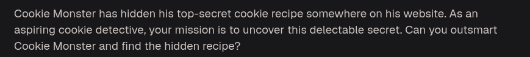
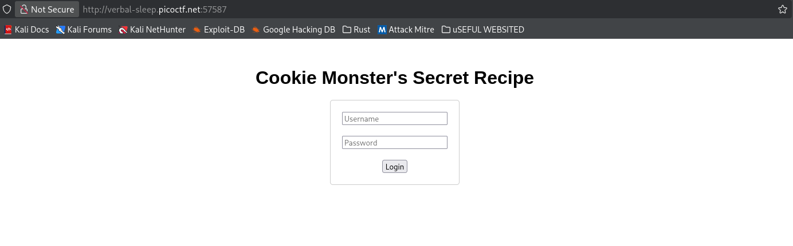
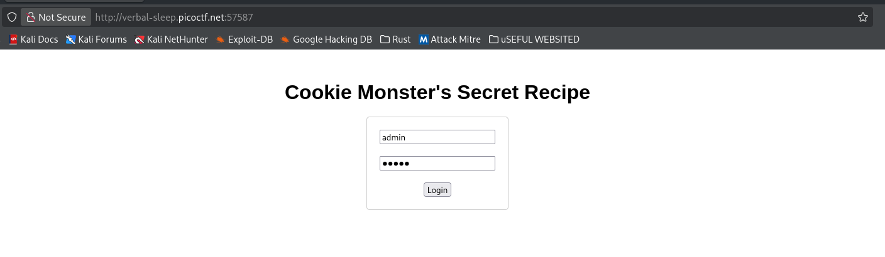
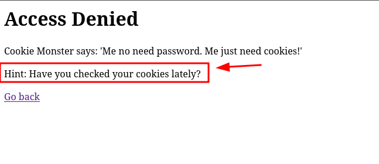
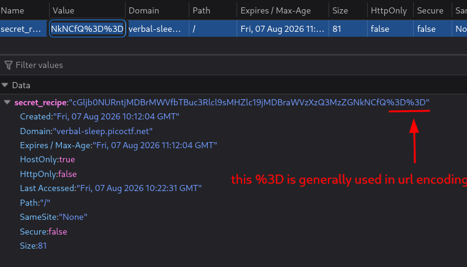
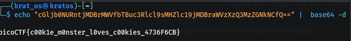

Try a random  username and password 






When you check the cookies yo see a value 



```
cGljb0NURntjMDBrMWVfbTBuc3Rlcl9sMHZlc19jMDBraWVzXzQ3MzZGNkNCfQ%3D%3D
```

now the %3D is a reference for url encoding 

| Character | URL Encoded | Common Use                             |
| --------- | ----------- | -------------------------------------- |
| Space     | `%20` / `+` | Separates words/values                 |
| `=`       | `%3D`       | Separates key and value (`key=value`)  |
| `&`       | `%26`       | Separates parameters (`a=1&b=2`)       |
| `/`       | `%2F`       | Directory/file paths                   |
| `?`       | `%3F`       | Starts query string                    |
| `#`       | `%23`       | URL fragment/anchor                    |
| `+`       | `%2B`       | Literal plus sign                      |
| `"`       | `%22`       | Quotation mark in encoded input        |
| `'`       | `%27`       | Apostrophe/quotation mark              |
| `<`       | `%3C`       | HTML tag delimiter                     |
| `>`       | `%3E`       | HTML tag delimiter                     |
also %3D is used in Base64 padding at the end of cookies/strings.

as == can confuse the cookie value so it is converted to %3D so if we pass this string through base64 decoder then we will get the next clue .

```
cGljb0NURntjMDBrMWVfbTBuc3Rlcl9sMHZlc19jMDBraWVzXzQ3MzZGNkNCfQ==
```

code 
```bash
echo "cGljb0NURntjMDBrMWVfbTBuc3Rlcl9sMHZlc19jMDBraWVzXzQ3MzZGNkNCfQ==" |  base64 -d
```




```
picoCTF{c00k1e_m0nster_l0ves_c00kies_4736F6CB} 
```