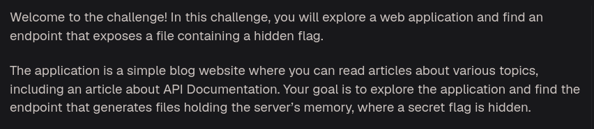
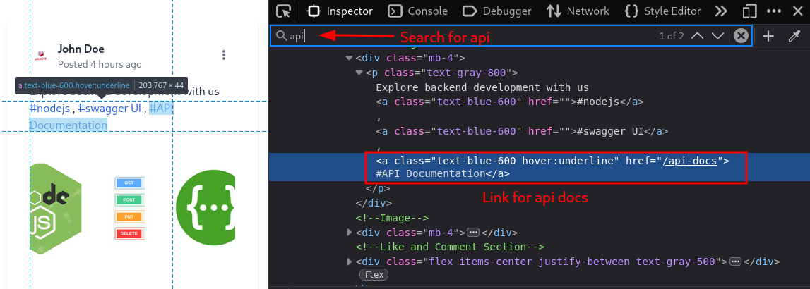
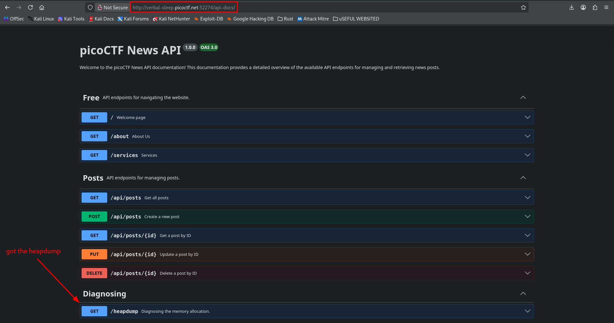
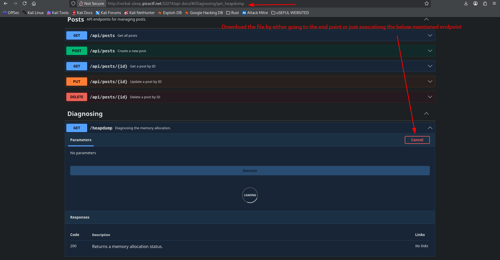
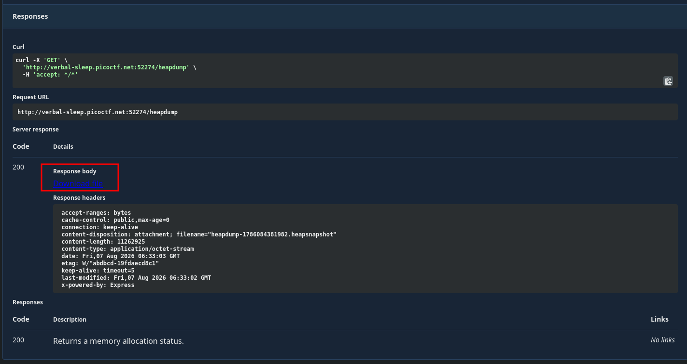
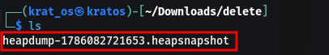
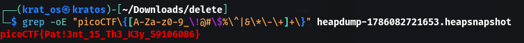

The question suggests that there should be a link to API Documentation somewhere on this website.



These are generally endpoints that are made by the developers and sometimes they use tools like SwaggerUI to document the endpoints they use during development 







Now that we have downloaded the heap dump - this is the static snapshot of a the website at a particular time and most prolly the flag should be somewhere in the file so we can use grep command to search for it 



Use this command to get the general structure right 

```bash
grep -oE "picoCTF\{[A-Za-z0-9_\!@#\$%\^|&\*\-\+]+\}" <filename>
```



```
picoCTF{Pat!3nt_15_Th3_K3y_59106086}
```

Also if the dump is in binary then you can use `strings`

```bash
strings <filename> | grep -oE "picoCTF\{[^\}]+\}"
```

here `[^\}]` - tells the terminal to match the starting `picoCTF{` and keep printing every single character it encounters until it hits the closing `}` bracket.